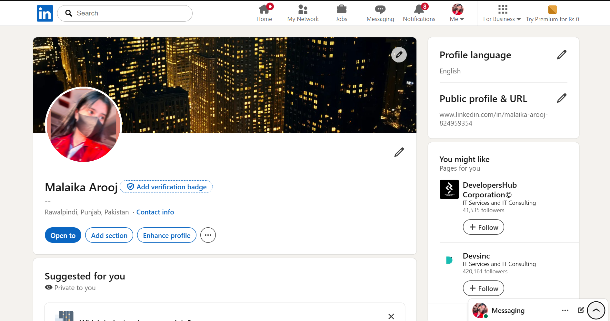

# 📊 Portfolio – [MALAIKA AROOJ]

Welcome to my data analyst portfolio! I specialize in turning raw data into meaningful insights using tools like Python, SQL. With hands-on project experience and a solid academic background, I bring both analytical depth and business understanding to every challenge.

---

## 👤 Profile Summary

My name is Malaika Arooj and I am a student of BCS IV (A) at Fatima Jinnah Women University. Technology has always interested me, especially the way it can be used to solve everyday challenges. Throughout my computer science journey, I have worked on small console-based programs and simple websites, which has been both engaging and a great learning experience. I enjoy collaborating with others and believe teamwork leads to more creative and effective solutions.

---

## 🧠 Skills

**Languages:** Python, C++, Java  
**Tools & Visualization:** Excel, Google Sheets, Jupyter Notebook  
**Databases:** MySQL. 

---

### 🔍 LinkedIn Job Trends Analyzer  
*Time Period*

- Scraped job postings from LinkedIn using **BeautifulSoup** and stored data in **PostgreSQL**
- Cleaned and analyzed data using **Pandas**, and built **interactive dashboards** in Tableau
- Project impacted 200+ students, with 37 successfully landing jobs using insights

---

## 🎓 Education

- Bachelor's in COMPUTER SCIENCE | [FATIMA JINNAH WOMEN UNIVERSITY] | Oct 2024-ongoing | 
- High School., Maths | FG Public School | June 2020 – Jan 2022 | Score: 85%

---

## 📜 Certifications & Awards

Recognized for outstanding performance secured 1st position in [Table Tennis] during Annual Sports Gala, [2023]
Achieved 3rd position in [Misali Tarbiyati Course], organized by [Jamia Salihaat].
Secured 1st position in Inter-School English story Writing Competition, 2018.
Secured 1st position in Inter-School English Essay Writing Competition, 2021.

---

## ❤️ Volunteer Experience

Volunteered in fundraising campaigns and helped raise funds for charitable causes.Actively participated in fundraising activities to support community welfare projects.

---

## 📬 Let’s Connect!

- 📧 Email: [aroojmalaika75@gmail.com]  
- 🔗 LinkedIn: [www.linkedin.com/in/malaika-arooj-824959354]  
- 💻 GitHub: [https://github.com/malaikaarooj07]

---

Thanks for stopping by! Feel free to explore my repositories and reach out if you'd like to collaborate or connect.
